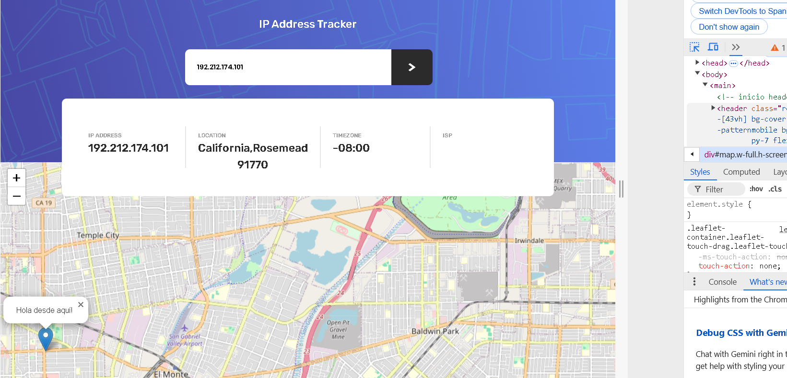
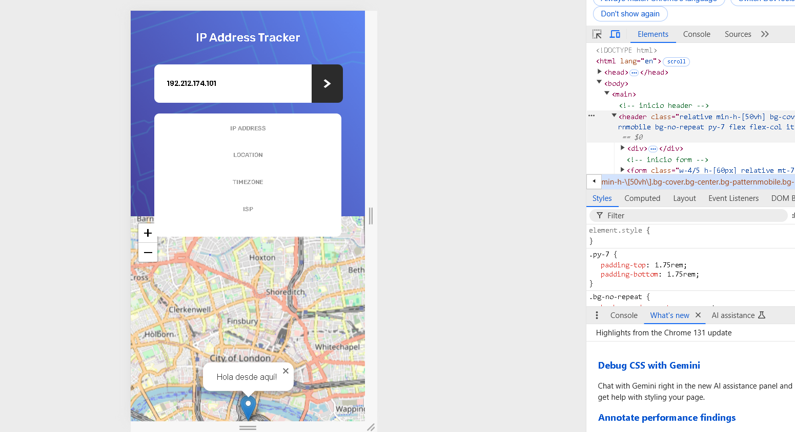

# Frontend Mentor - IP address tracker solution

This is a solution to the [IP address tracker challenge on Frontend Mentor](https://www.frontendmentor.io/challenges/ip-address-tracker-I8-0yYAH0). Frontend Mentor challenges help you improve your coding skills by building realistic projects. 

## Table of contents

- [Overview](#overview)
  - [The challenge](#the-challenge)
  - [Screenshot](#screenshot)
  - [Links](#links)
- [My process](#my-process)
  - [Built with](#built-with)
  - [What I learned](#what-i-learned)
  - [Continued development](#continued-development)
  - [Useful resources](#useful-resources)
- [Author](#author)
- [Requirements](#requirements)
- [Install](#install)
- [Deployment](#deployment)


## Overview

### The challenge

Users should be able to:

- View the optimal layout for each page depending on their device's screen size
- See hover states for all interactive elements on the page
- See their own IP address on the map on the initial page load
- Search for any IP addresses or domains and see the key information and location

### Screenshot





### Links

- Solution URL: [Add solution URL here](https://your-solution-url.com)
- Live Site URL: [Add live site URL here](https://your-live-site-url.com)

## My process

### Built with

- Semantic HTML5 markup
- CSS custom properties
- Flexbox
- CSS Grid
- Mobile-first workflow


### What I learned


### Continued development

- full stack technologies

### Useful resources

- [background image in tailwindcss](https://tailwindcss.com/docs/background-image) - This resource helped me set up CSS syntax for the image background using tailwindcss


## Author

- Frontend Mentor - [@rineliniguezsosa](https://www.frontendmentor.io/profile/rineliniguezsosa)

## Requirements 

- [Visual Studio Code](https://code.visualstudio.com/) (or any other code editor of your choice)
- [Live Server Extension](https://marketplace.visualstudio.com/items?itemName=ritwickdey.LiveServer) for Visual Studio Code

## Install

Follow these steps to download and run the project locally

1. **Clone this repository:**

  Open your terminal and run the following command:

   ```bash
   git clone https://github.com/rineliniguezsosa/ip-address-tracker.git
   ```

2.- **Navigate to the project directory:**

```bash
cd ip-address-tracker-master
```

3.-**Open the project in Visual Studio Code:**

```bash
code .
```

## Deployment

To deploy the project locally using vite, follow these steps:

1. **Install the dependencies:**

```bash
npm install
```
2. **Set up your API key:**

In order for the project to work properly, you will need an IPInfo.io API key. 
Sign up and get your API key.

- In the index.js file, find the URL where the API request is made (using fetch), and replace API_KEY with your API key.

```js
const req = await fetch(`https://ipinfo.io/${ipaddress}?token=API_KEY`);
```
3. **Start the development server:**

```bash
npm run dev
```

4. **View the project:**

- Vite Server will open a new tab in your browser with the URL http://localhost:5173/ (URL may vary). Here you can see your project in operation.


